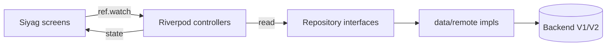

# Architecture — Siyaq Mobile (current state)

Documents the architecture **as implemented today**, not an idealized target.

## App layers

Feature-first clean architecture. Each feature is split into three layers with a
one-way dependency (presentation → domain ← data):

| Layer | Holds | Rule |
|---|---|---|
| `domain/` | entities, abstract repository interfaces, errors | pure Dart; no Flutter, no DTOs |
| `data/` | remote clients, JSON→domain mappers, concrete repos, secure stores | depends on domain only |
| `presentation/` | Riverpod controllers, screens, feature widgets | depends on domain (+ shared `core`) |

Abstract repositories are the swap seam: production wires `data/remote/*`; tests
wire in-memory fakes from `test/support/`.

## Main modules

- **`core/`** — cross-cutting: `config` (base URLs, versions), `network` (V1 Dio
  client), `localization` (bilingual table), `theme` (tokens + ThemeData),
  `widgets/siyag` (shared design-system widgets).
- **`features/game/`** — V1 Solo game: `ContextGameApi`, `GameRepository(Impl)`,
  `GameController`, plus `AppSettingsController` (lang/sound/haptics/**themeMode**/
  baseUrlOverride) and local `StatsController`.
- **`features/v2/`** — the V2 brain: domain entities (weekly, room, room_event,
  leaderboard, installation_profile, capabilities, …), abstract
  `v2_repositories`, `data/remote/*` (`V2ApiClient`, mappers, remote repos,
  realtime gateway), `data/{installation_id_store,session_store}`, and Riverpod
  controllers (`v2_providers`, profile/weekly/leaderboard/room/realtime).
- **`features/siyag/`** — the **live UI**: `SiyagShell` + screens; presentation
  only, consuming `game` + `v2` controllers.
- **`features/auth/`** — Google sign-in, session lifecycle, account (in
  progress): `AuthRepository`/`RemoteAuthRepository`, `GoogleAuthGateway`,
  `SessionController`.

## State flow



Controllers own state (`Notifier`/`AsyncNotifier`); UI is a pure function of
provider state. `v2_providers.dart` is the dependency-injection seam.

## Navigation flow

Single `Navigator`. `SiyagShell` (`IndexedStack`, `siyagTabProvider`) hosts
Home/Leaderboard/Profile; full-screen flows (practice/weekly/multiplayer/result)
are pushed via `siyagRoute` and hide the bottom nav. No router package.

## Networking flow

Two Dio clients share one base URL: V1 `ApiClient` (`/api/context-game`, no
auth) and V2 `V2ApiClient` (`/api/context-game/v2`). `V2ApiClient` injects
`X-Installation-ID` (guest) + `Authorization: Bearer` (account) + `X-Request-ID`,
adds `X-Game-Language`/`Idempotency-Key` per request, maps the stable error
envelope to `V2Exception`, and drops a rejected session on 401. Realtime uses
`web_socket_channel` via `RemoteRealtimeGateway` with a `SequenceTracker`
(dedup + gap detection) and `ReconnectPolicy` (exponential backoff); REST
snapshots are authoritative on recovery.

## Theme flow

```mermaid
flowchart TD
  S[AppSettings.themeMode\n(SharedPreferences)] --> A[app.dart]
  P[platformBrightness] --> A
  A -->|SC.applyBrightness| SC[SC tokens]
  A -->|theme/darkTheme/themeMode| M[MaterialApp]
  T[AppTokens.light/dark] --> SC
  T --> TH[AppTheme.light/dark]
  SC --> W[custom Siyag screens]
  TH --> MC[Material components]
```

`AppTokens` is the single palette source; `SC` exposes it to custom screens,
`AppTheme` to Material. `app.dart` resolves the effective brightness and syncs
both before the subtree builds; `SiyagShell` re-keys its `IndexedStack` by
brightness so a toggle repaints visible tabs immediately.

## Localization flow

`localizationsProvider` derives `AppLocalizations(lang)` from `AppSettings.lang`.
`loc('key')` looks up `strings_ar`/`strings_en` (fallback: en → key). Screens set
`Directionality` for RTL. `MaterialApp.locale` + `GlobalMaterialLocalizations`
handle framework widgets.

## Persistence flow

- `SharedPreferences` (sync, loaded in `main.dart`, provider-overridden):
  language, sound, haptics, **themeMode**, dev base-URL override, local stats.
- `flutter_secure_storage`: installation UUID (`InstallationIdStore`) and account
  session token (`SessionStore`) — never a hardware id, never a Google token.

## Important dependencies

`flutter_riverpod` ^3.3, `dio` ^5.10, `web_socket_channel` ^3.0,
`flutter_secure_storage` ^10.3, `shared_preferences` ^2.5, `uuid` ^4.6,
`google_sign_in` ^7.2, `share_plus` ^13.2, `flutter_localizations`;
dev: `flutter_lints` ^6, `integration_test`, `flutter_launcher_icons` ^0.14.

## Known architectural constraints

- Custom screens read the global `SC` tokens (no `BuildContext`), so they don't
  auto-subscribe to `Theme` changes; the shell re-keys by brightness to force a
  repaint on toggle. New standalone routes should be entered fresh (they read
  current tokens at build) — avoid relying on live re-theming of an already-
  visible pushed route.
- Two coexisting UI generations remain: the **live Siyag** screens and **legacy
  Amber-Noir** screens (`features/{game,v2}/presentation/screens/*`) that are
  compiled but unrouted (kept only for their widget tests). Prefer building on
  Siyag; the legacy set is scheduled for removal.
- Backend is authoritative and its contract is frozen; the client mirrors, never
  computes, economy/rating/room state.
